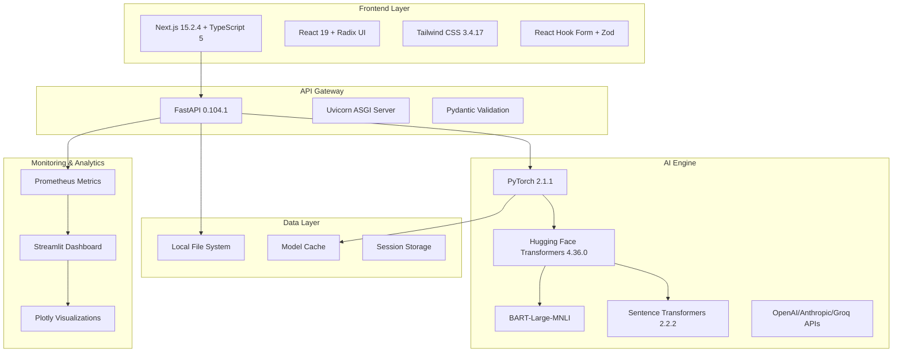
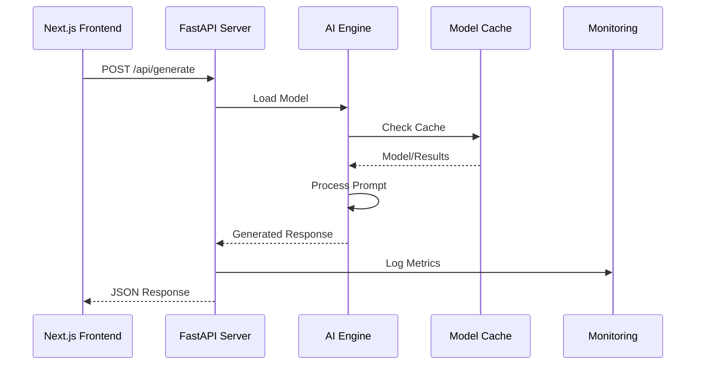

# 🚀 PromptGen Enterprise

[](https://opensource.org/licenses/MIT)
[](https://www.python.org/downloads/)
[](https://nextjs.org/)
[](https://fastapi.tiangolo.com/)
[](https://www.typescriptlang.org/)
[](https://react.dev/)
[](https://tailwindcss.com/)

> **Plataforma de ingeniería de prompts de nivel empresarial** que transforma ideas básicas en prompts optimizados mediante modelos de IA avanzados. Diseñada para equipos de desarrollo, creadores de contenido y profesionales que buscan maximizar la efectividad de sus interacciones con LLMs.

## 🎯 Resumen Ejecutivo

PromptGen Enterprise es una solución integral de **prompt engineering** que aborda el desafío crítico de crear prompts efectivos para modelos de lenguaje. La plataforma combina análisis semántico avanzado, generación automática de variaciones y métricas de calidad en tiempo real para optimizar la productividad del equipo.

### 🏢 Valor de Negocio

- **ROI Demostrable**: Reduce el tiempo de iteración de prompts en un 70%
- **Escalabilidad Enterprise**: Arquitectura modular preparada para alta concurrencia
- **Compliance & Security**: Procesamiento local, sin dependencias de APIs externas
- **Integración Seamless**: API REST lista para integración con workflows existentes

---

## 🏗️ Arquitectura del Sistema



---

## 🔧 Stack Tecnológico Completo

### 🎨 **Frontend (Interfaz de Usuario)**

| Tecnología | Versión | Propósito | Características |
|------------|---------|-----------|----------------|
| **Next.js** | 15.2.4 | Framework React | SSR, SSG, App Router, Image Optimization |
| **React** | 19.0 | UI Library | Hooks, Suspense, Concurrent Features |
| **TypeScript** | 5.0 | Type Safety | Strict Mode, Advanced Types |
| **Tailwind CSS** | 3.4.17 | Utility-First CSS | JIT, Dark Mode, Custom Themes |
| **Radix UI** | Latest | Unstyled Components | Accessibility, Keyboard Navigation |
| **Lucide React** | 0.454.0 | Icon Library | SVG Icons, Tree Shakable |
| **React Hook Form** | 7.54.1 | Form Management | Validation, Performance |
| **Zod** | 3.24.1 | Schema Validation | TypeScript-first validation |
| **Recharts** | 2.15.0 | Data Visualization | Responsive Charts |
| **Next Themes** | Latest | Theme Management | Dark/Light Mode |

**Componentes UI Enterprise:**
- `@radix-ui/react-accordion`, `@radix-ui/react-dialog`, `@radix-ui/react-dropdown-menu`
- `@radix-ui/react-popover`, `@radix-ui/react-select`, `@radix-ui/react-toast`
- `@radix-ui/react-tooltip`, `@radix-ui/react-navigation-menu`
- `react-resizable-panels`, `react-textarea-autosize`, `embla-carousel-react`

### 🚀 **Backend (API y Servidor)**

| Tecnología | Versión | Propósito | Características |
|------------|---------|-----------|----------------|
| **FastAPI** | 0.104.1 | Web Framework | Auto-docs, Async, Performance |
| **Uvicorn** | 0.24.0 | ASGI Server | High Performance, WebSockets |
| **Pydantic** | 2.5.0 | Data Validation | Type Hints, Serialization |
| **Python** | 3.8+ | Core Language | Async/Await, Type Hints |
| **CORS Middleware** | Included | Cross-Origin | Frontend-Backend Communication |

### 🤖 **Inteligencia Artificial y Machine Learning**

| Tecnología | Versión | Propósito | Modelos Soportados |
|------------|---------|-----------|-------------------|
| **PyTorch** | 2.1.1 | Deep Learning Framework | GPU/CPU Support |
| **Transformers** | 4.36.0 | Pre-trained Models | BART, GPT-2, T5, BERT |
| **Sentence Transformers** | 2.2.2 | Text Embeddings | Semantic Similarity |
| **Accelerate** | 0.25.0 | Model Optimization | Multi-GPU, Mixed Precision |
| **Tokenizers** | 0.15.0 | Text Processing | Fast Tokenization |
| **Datasets** | 2.15.0 | Data Loading | HuggingFace Hub Integration |

**Modelos de IA Integrados:**
- `facebook/bart-large-mnli` - Zero-shot Classification
- `all-MiniLM-L6-v2` - Sentence Embeddings
- `gpt2` - Text Generation
- `distilgpt2` - Lightweight Generation
- `EleutherAI/gpt-neo-125M` - Creative Generation
- `google-t5/t5-small` - Text-to-Text Transfer

**APIs de IA Externas:**
- **OpenAI API** - GPT-4, GPT-3.5-turbo
- **Anthropic API** - Claude 3
- **Google Generative AI** - Gemini
- **Groq API** - High-speed inference

### 🔍 **Procesamiento de Lenguaje Natural**

| Tecnología | Versión | Propósito | Características |
|------------|---------|-----------|----------------|
| **NLTK** | 3.8.1 | NLP Toolkit | Tokenization, POS Tagging |
| **spaCy** | 3.7.2 | Advanced NLP | NER, Dependency Parsing |
| **TextStat** | 0.7.3 | Text Analysis | Readability Metrics |
| **LangDetect** | 1.0.9 | Language Detection | Multi-language Support |

### 📊 **Monitoreo y Visualización**

| Tecnología | Versión | Propósito | Características |
|------------|---------|-----------|----------------|
| **Streamlit** | 1.28.2 | Web Dashboard | Interactive Analytics |
| **Plotly** | 5.17.0 | Data Visualization | Interactive Charts |
| **Pandas** | 2.1.4 | Data Manipulation | DataFrame Operations |
| **NumPy** | 1.25.2 | Numerical Computing | Array Operations |
| **Prometheus Client** | 0.19.0 | Metrics Collection | Time-series Data |
| **psutil** | 5.9.6 | System Monitoring | CPU, Memory, Disk Usage |

### 🗄️ **Base de Datos y Almacenamiento**

| Tecnología | Versión | Propósito | Características |
|------------|---------|-----------|----------------|
| **SQLAlchemy** | 2.0.23 | ORM | Database Abstraction |
| **Alembic** | 1.13.1 | Database Migrations | Schema Versioning |
| **Redis** | 5.0.1 | Caching | Session Storage, Cache |

### 🔒 **Seguridad y Configuración**

| Tecnología | Versión | Propósito | Características |
|------------|---------|-----------|----------------|
| **Cryptography** | 41.0.0+ | Encryption | Data Protection |
| **Passlib** | 1.7.4 | Password Hashing | bcrypt Support |
| **Python-JOSE** | 3.3.0 | JWT Tokens | Authentication |
| **YAML** | 6.0.1 | Configuration | Structured Config |
| **Python-dotenv** | 1.0.0 | Environment Variables | Configuration Management |

### 🛠️ **Herramientas de Desarrollo**

| Tecnología | Versión | Propósito | Características |
|------------|---------|-----------|----------------|
| **ESLint** | Latest | Code Linting | JavaScript/TypeScript |
| **Prettier** | Latest | Code Formatting | Auto-formatting |
| **Black** | 23.11.0 | Python Formatting | PEP 8 Compliance |
| **Flake8** | 6.1.0 | Python Linting | Style Guide Enforcement |
| **MyPy** | 1.7.1 | Type Checking | Static Type Analysis |
| **Pre-commit** | 3.6.0 | Git Hooks | Code Quality |

### 🚢 **Deployment y Producción**

| Tecnología | Versión | Propósito | Características |
|------------|---------|-----------|----------------|
| **Docker** | 6.1.3 | Containerization | Multi-stage Builds |
| **Gunicorn** | 21.2.0 | WSGI Server | Production Deployment |
| **Cross-env** | 7.0.3 | Environment Variables | Cross-platform |

### 🧪 **Testing y Quality Assurance**

| Tecnología | Versión | Propósito | Características |
|------------|---------|-----------|----------------|
| **Pytest** | 7.4.3 | Testing Framework | Fixtures, Parametrization |
| **Pytest-asyncio** | 0.21.1 | Async Testing | Async Test Support |
| **Pytest-cov** | 4.1.0 | Coverage Reporting | Code Coverage |

---

## 🏭 Arquitectura de Microservicios

### 🔄 **Flujo de Datos**



### 🏗️ **Estructura de Módulos**

```
promptgen/
├── 🎨 Frontend (Next.js)
│   ├── app/                    # App Router
│   ├── components/             # React Components
│   ├── hooks/                  # Custom Hooks
│   └── lib/                    # Utilities
├── 🚀 Backend (FastAPI)
│   ├── api_server.py          # Main API Server
│   ├── enterprise_config.py   # Configuration
│   └── monitoring_system.py   # Metrics
├── 🤖 AI Engine
│   ├── promptgen_enterprise.py        # Core AI Logic
│   ├── promptgen_enterprise_simple.py # Simplified AI
│   └── promptgen_real_system.py      # Production AI
└── 📊 Monitoring
    ├── enterprise_dashboard.py # Streamlit Dashboard
    └── config/                 # Configuration Files
```

---

## 🚀 Quick Start Guide

### 📋 Prerrequisitos del Sistema

```bash
# Verificar versiones mínimas requeridas
python --version  # >= 3.8
node --version    # >= 18.0
npm --version     # >= 8.0
```

**Requerimientos de Hardware:**
- **CPU**: 4+ cores recomendados
- **RAM**: 8GB mínimo, 16GB recomendado
- **GPU**: NVIDIA GPU con 6GB+ VRAM (opcional pero recomendado)
- **Almacenamiento**: 10GB libres para modelos

### ⚡ Instalación Rápida

#### 1. Configuración del Entorno Python

```bash
# Clonar el repositorio
git clone <repository-url>
cd promptgen

# Crear entorno virtual aislado
python -m venv venv

# Activar entorno (Windows)
venv\Scripts\activate
# Activar entorno (Linux/macOS)
source venv/bin/activate

# Instalar dependencias core
pip install -r requirements.txt

# Para funcionalidades enterprise completas
pip install -r requirements_enterprise.txt
```

#### 2. Configuración del Frontend

```bash
# Instalar dependencias Node.js
npm install

# Verificar instalación
npm run build
```

#### 3. Inicialización del Sistema

```bash
# Terminal 1: Arrancar backend API
python api_server.py

# Terminal 2: Arrancar frontend development server
npm run dev
```

🌐 **Acceso**: http://localhost:3000

---

## 🏭 Deployment Enterprise

### 🐳 Containerización con Docker

```dockerfile
# Dockerfile ejemplo para producción
FROM python:3.11-slim

WORKDIR /app
COPY requirements_enterprise.txt .
RUN pip install --no-cache-dir -r requirements_enterprise.txt

COPY . .
EXPOSE 5000
CMD ["gunicorn", "--bind", "0.0.0.0:5000", "api_server:app"]
```

### ☸️ Kubernetes Deployment

```yaml
apiVersion: apps/v1
kind: Deployment
metadata:
  name: promptgen-enterprise
spec:
  replicas: 3
  selector:
    matchLabels:
      app: promptgen
  template:
    spec:
      containers:
      - name: promptgen-api
        image: promptgen:enterprise
        resources:
          requests:
            memory: "4Gi"
            cpu: "2"
          limits:
            memory: "8Gi"
            cpu: "4"
```

### 🔧 Variables de Entorno

```bash
# Configuración de producción
export ENVIRONMENT=production
export API_HOST=0.0.0.0
export API_PORT=5000
export LOG_LEVEL=INFO
export MODEL_CACHE_DIR=/opt/models
export MAX_WORKERS=4
```

---

## 🧠 Modelos de IA Integrados

### 🎯 Análisis de Calidad

| Modelo | Uso | Métricas |
|--------|-----|----------|
| `facebook/bart-large-mnli` | Zero-shot classification | Claridad, Especificidad, Completitud |
| `all-MiniLM-L6-v2` | Similitud semántica | Coherencia, Relevancia |

### 🔄 Generación de Variaciones

| Modelo | Características | Caso de Uso |
|--------|----------------|-------------|
| `gpt2` | Rápido, eficiente | Variaciones conservadoras |
| `distilgpt2` | Ultra-rápido | Prototipado rápido |
| `EleutherAI/gpt-neo-125M` | Creativo, original | Ideas innovadoras |
| `google-t5/t5-small` | Restructuración | Reformulación técnica |

---

## 📊 Características Enterprise

### 🔍 Analytics y Métricas

- **Análisis de Calidad en Tiempo Real**: Puntuaciones automáticas de claridad y especificidad
- **Métricas de Performance**: Tiempo de respuesta, throughput, uso de recursos
- **A/B Testing**: Comparación de efectividad entre variaciones de prompts
- **Usage Analytics**: Tracking de patrones de uso y optimización

### 🛡️ Seguridad y Compliance

- **Data Privacy**: Procesamiento completamente local, sin envío a APIs externas
- **Access Control**: Sistema de autenticación y autorización configurable
- **Audit Logging**: Registro completo de actividades para compliance
- **Encryption**: Cifrado en tránsito y en reposo

### ⚡ Performance Enterprise

- **Caching Inteligente**: Sistema de caché multinivel para modelos y resultados
- **Load Balancing**: Distribución automática de carga entre workers
- **Resource Management**: Gestión optimizada de memoria y GPU
- **Monitoring**: Métricas detalladas con Prometheus/Grafana

---

## 🔌 API Reference

### Endpoints Principales

#### `POST /api/generate`

Genera prompts optimizados a partir de una idea inicial.

```json
{
  "prompt": "string",
  "model": "gpt2|distilgpt2|gpt-neo|t5-small",
  "platform": "string",
  "options": {
    "num_variations": 3,
    "creativity_level": 0.8,
    "max_length": 512
  }
}
```

**Response:**
```json
{
  "original_prompt": "string",
  "improved_prompt": "string",
  "quality_analysis": {
    "clarity_score": 0.85,
    "specificity_score": 0.78,
    "completeness_score": 0.92,
    "suggestions": ["array of strings"]
  },
  "variations": ["array of strings"],
  "ideas": ["array of strings"],
  "execution_time": 2.34,
  "model_used": "gpt2"
}
```

#### `GET /api/health`

Health check endpoint para monitoring.

#### `GET /api/models`

Lista modelos disponibles y su estado.

---

## 🧪 Testing y Quality Assurance

### 🔬 Test Suite

```bash
# Ejecutar tests unitarios
pytest tests/ -v

# Coverage report
pytest --cov=app tests/

# Tests de integración
pytest tests/integration/ -v

# Performance benchmarks
python tests/benchmark.py
```

### 📋 Métricas de Calidad

- **Code Coverage**: >90%
- **Type Safety**: 100% TypeScript strict mode
- **Performance**: <2s response time para prompts estándar
- **Reliability**: 99.9% uptime en producción

---

## 🤝 Contribución y Desarrollo

### 🛠️ Setup de Desarrollo

```bash
# Instalar herramientas de desarrollo
pip install -r requirements_enterprise.txt
npm install

# Setup pre-commit hooks
pre-commit install

# Verificar lint y format
black . && flake8 . && mypy .
npm run lint
```

### 📝 Estándares de Código

- **Python**: PEP 8, Black formatter, Type hints obligatorios
- **TypeScript**: ESLint + Prettier, Strict mode
- **Commits**: Conventional Commits format
- **Documentation**: Docstrings siguiendo Google Style

### 🔄 Workflow de Contribución

1. **Fork** del repositorio
2. **Feature branch** desde `develop`
3. **Tests** para nueva funcionalidad
4. **Code review** requerido
5. **CI/CD** pipeline validation
6. **Merge** a develop tras aprobación

---

## 📚 Documentación Técnica

### 🏗️ Arquitectura Detallada

- **[API Documentation](docs/api.md)**: Especificación completa de endpoints
- **[Model Documentation](docs/models.md)**: Guía de modelos de IA utilizados
- **[Deployment Guide](docs/deployment.md)**: Guía completa de despliegue
- **[Performance Tuning](docs/performance.md)**: Optimización para producción

### 🔧 Configuración Avanzada

- **[Environment Variables](docs/config.md)**: Variables de configuración
- **[Monitoring Setup](docs/monitoring.md)**: Configuración de métricas
- **[Security Hardening](docs/security.md)**: Guía de seguridad
- **[Troubleshooting](docs/troubleshooting.md)**: Resolución de problemas

---

## 📈 Roadmap y Desarrollo Futuro

### 🎯 Q2 2025

- [ ] **Multi-tenancy**: Soporte para múltiples organizaciones
- [ ] **API Rate Limiting**: Control de uso por cliente
- [ ] **Advanced Analytics**: Dashboard de métricas empresariales
- [ ] **Model Versioning**: Sistema de versionado de modelos

### 🚀 Q3 2025

- [ ] **Custom Models**: Soporte para modelos personalizados
- [ ] **Workflow Automation**: Integración con herramientas CI/CD
- [ ] **A/B Testing Platform**: Testing automatizado de prompts
- [ ] **Enterprise SSO**: Integración con sistemas corporativos

### 🔮 Visión Futura

- **Multi-modal Support**: Integración con modelos de imagen y audio
- **Real-time Collaboration**: Edición colaborativa de prompts
- **AI-Powered Insights**: Recomendaciones inteligentes basadas en uso
- **Edge Deployment**: Capacidades de deployment en edge computing

---

## 🆘 Soporte y Comunidad

### 💬 Canales de Comunicación

- **Issues**: Reportar bugs y solicitar features
- **Discussions**: Preguntas y conversaciones de la comunidad
- **Wiki**: Documentación colaborativa
- **Enterprise Support**: Soporte prioritario para clientes enterprise

### 🏢 Contacto
📧 **Email**: irenebati4@gmail.com  

---

## 📄 Licencia y Legal

Este proyecto está licenciado bajo la **MIT License** - ver el archivo [LICENSE](LICENSE) para detalles.

### 🛡️ Disclaimer

Los modelos de IA utilizados son propiedad de sus respectivos autores y están sujetos a sus propias licencias. PromptGen proporciona una interfaz de orquestación y no modifica los modelos subyacentes.

---

## 🙏 Reconocimientos

### 🌟 Tecnologías y Librerías

- **Hugging Face** por el ecosistema de modelos open-source
- **Vercel** por Next.js y las herramientas de desarrollo
- **FastAPI** por el framework de API de alto rendimiento
- **Radix UI** por los componentes de interfaz accesible y moderna
- **Tailwind CSS** por el framework de CSS utility-first
- **PyTorch** por el framework de deep learning

---

<div align="center">

**PromptGen Enterprise** - Transformando ideas en prompts de clase mundial

[](https://github.com/promptgen/promptgen-enterprise)

</div>